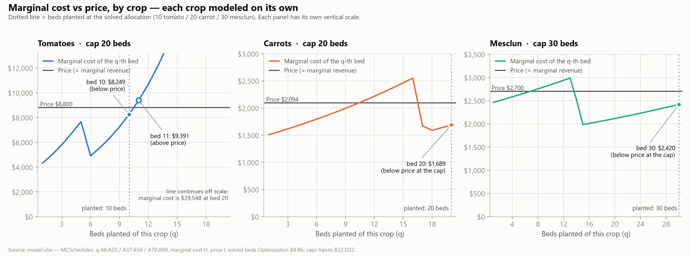
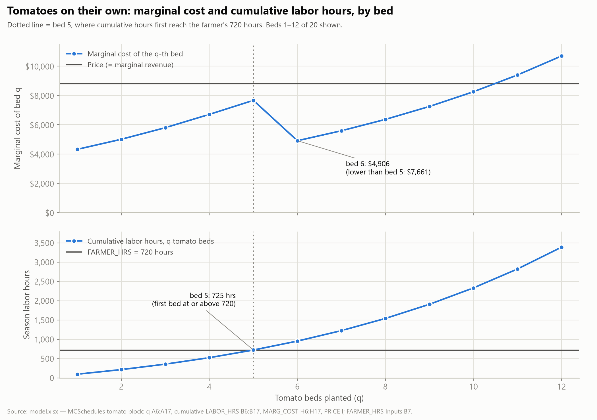
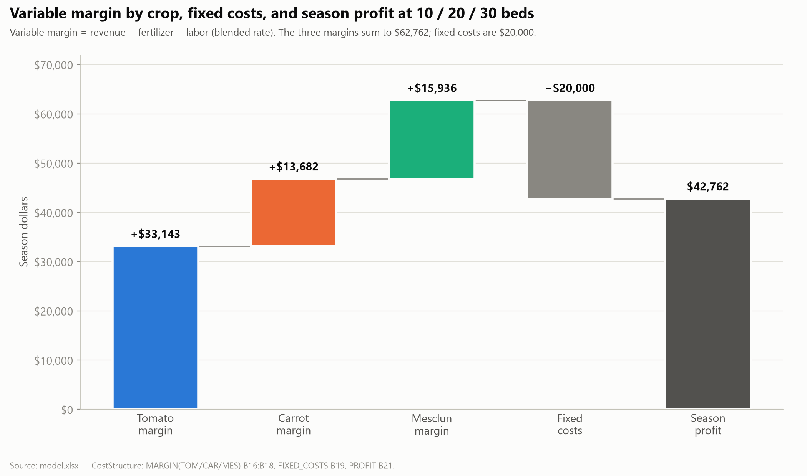

# Farm Model Analysis

## Result

The profit-maximizing mix is 10 tomato beds, 20 carrot beds and 30 mesclun beds (`Optimization!B4:B6`). That uses 60 of the farm's 64 beds and earns a season profit of $42,761.66 after $20,000 in fixed costs (`CostStructure!B21`). The carrot and mesclun max-bed caps are the only binding limits; tomatoes, the 64-bed total and labor hours all have room to spare. Removing every limit adds only $2,249.13, because diminishing returns shrink each extra bed's contribution quickly.

## Why tomatoes stop at 10 beds

Tomatoes earn the most per bed, especially on the first few beds, but their 10% diminishing-returns rate (`Inputs!B18`) drives marginal cost up quickly. The 10th bed costs $8,248.59 (`MCSchedules!H15`), below the $8,800 price (`Inputs!B21`), so it adds $551.41. The 11th bed costs $9,390.72 (`MCSchedules!H16`), $590.72 above the price, so it loses money (Figure 1).

Profit shows the same turn. It rises from $25,621.36 at 9 beds to $26,172.77 at 10, then falls to $25,582.06 at 11 (`MCSchedules!K14:K16`, before fixed costs). Tomatoes therefore stop at 10 beds even though their cap is 20 (`Inputs!B22`), and relaxing the tomato cap is worth $0 (`Summary!K36`).

**Figure 1** — Marginal cost of each bed against price, for each crop on its own. The dotted line marks the beds planted in the solved mix (10 tomato, 20 carrot, 30 mesclun). Tomato marginal cost crosses the $8,800 price between bed 10 and bed 11. Carrot and mesclun marginal cost rises above price and then drops back under it (carrots beds 11–16, mesclun beds 7–13). Data: `MCSchedules` and `Optimization!B4:B6`.

## The wage switch: dips in every crop's marginal cost

Tomato marginal cost rises from $4,317.50 at bed 1 to $7,660.86 at bed 5, then drops to $4,906.28 at bed 6 (`MCSchedules!H6`, `H10`, `H11`; Figure 2). The cause is the labor rate. By bed 5, cumulative labor reaches 724.73 hours (`MCSchedules!B10`), just past my own 720 hours (`Inputs!B7`), so the work shifts from me at $34.72 an hour (`Inputs!B9`) to temporary workers at $17.36 an hour (`Inputs!B12`). Halving the wage resets the marginal-cost curve to a lower starting point.

Without that switch, tomatoes would stop much earlier. If I had more hours of my own, or had to hire a second worker at my rate, every hour would cost $34.72. The 6th bed would then cost about $8,932.55, above the $8,800 price, and tomatoes would stop at 5 beds (derived).

**Figure 2** — Tomato marginal cost (top) and cumulative labor hours (bottom), beds 1 to 12. The dotted line is bed 5, where cumulative hours first pass my 720 hours; marginal cost then falls from $7,660.86 at bed 5 to $4,906.28 at bed 6. Data: `MCSchedules`, `Inputs!B7`.

The same wage switch shapes carrots and mesclun. Carrot marginal cost rises above the $2,094 price from bed 11 ($2,140.11) through bed 16 ($2,552.10), then drops back under it at bed 17 ($1,670.90) and stays there through the 20-bed cap. Mesclun rises above the $2,700 price from bed 7 ($2,710.71) through bed 13 ($2,988.40) and drops back under at bed 14 ($2,522.58) (`MCSchedules!H37:H56`, `H70:H99`; Figure 1). The model flags both: the first crossing is bed 11 for carrots and bed 7 for mesclun (`MCSchedules!B59`, `B102`), and both schedules are marked non-monotonic (`B60`, `B103`). The drop spans two beds (carrots 17–18, mesclun 14–15) because the switch from my hours to temporary labor happens partway through a bed, which is still partly paid at my rate.

Because of these dips, stopping at the first bed where marginal cost passes price would be wrong: carrots would stop at 10 beds and mesclun at 6. What matters is whether the beds past the dip earn back what the spike lost. Summing price minus marginal cost over each stretch (derived from `MCSchedules` column H):

| | Before the spike | Spike | After the drop | Total |
|---|---|---|---|---|
| Carrots | beds 1–10: +$3,205.79 | beds 11–16: −$1,483.55 | beds 17–20: +$1,788.84 | +$3,511.08 |
| Mesclun | beds 1–6: +$819.53 | beds 7–13: −$1,032.08 | beds 14–30: +$8,290.36 | +$8,077.81 |

The totals equal each crop's standalone profit at its cap (`MCSchedules!K56`, `K99`). For mesclun, the case is clear: 30 beds earn $7,258.28 more than 6. For carrots, it is thin: 20 beds earn only $305.29 more than stopping at 10.

These schedules treat each crop as if it had all 720 of my hours to itself. In the actual plan the three crops share those hours, so the spikes would not fall on exactly these beds. The point still holds, and at the margin the numbers agree: the whole-farm marginal cost of the 21st carrot bed, $1,741.51 (`Summary!G37`), is the same as the standalone figure (`MCSchedules!H112`).

## Binding constraints and shadow prices

Carrots (20 beds) and mesclun (30 beds) are both planted to their caps (`Inputs!C22`, `Inputs!D22`), and the model names those caps as the binding limit (`Optimization!B29`). The other limits have slack:

- **Beds:** 60 of 64 used, 4 unused (`Optimization!E14`).
- **Labor:** 5,277.22 of 6,480 hours used, 1,202.78 unused (`Optimization!E22`). Temporary labor equals 3.16 of the 4 available workers (`Summary!B18`).

The shadow prices, the value of one more bed under each cap, are $352.49 for carrots and $246.47 for mesclun (`Summary!K37:K38`); tomatoes and the slack limits are worth $0. Only the first extra bed is worth the full shadow price, and each bed after it is worth less (carrots: $352.49, then $298.09, then $241.77; `Unconstrained!I81:I83`).

## Scenario A: all limits removed

The `Unconstrained` tab removes the crop caps, the 64-bed total and the worker limit. It answers the question I set out to test: if carrots and mesclun expand, do I run out of labor? I do not.

- **Beds:** 10 tomato, 26 carrot, 37 mesclun, 73 in total (`Unconstrained!B7:E7`). Tomatoes do not change.
- **Labor:** 6,453.11 of 6,480 hours, 26.89 under the limit (`Unconstrained!D32`), or 3.98 of the 4 temporary workers (`Unconstrained!B34`).
- **Profit:** $45,010.80 (`Unconstrained!E20`), $2,249.13 or about 5.3% more than today (`Unconstrained!E22`).

Labor was never the constraint; the crop caps were.

What this scenario leaves out is the cost of land. The 73 beds are 9 more than the farm has (`Unconstrained!D26`), and the model has no cost for extra land.

## Scenario B: fertilizer bulk discount

The wage change is one input that bends the marginal-cost curve. The `FertScenario` tab tests another: a 30% bulk discount on fertilizer for every bed beyond 40 across the whole farm (`FertScenario!B7:B8`). Each discounted bed saves $264 (30% of $880).

Like the wage change, the discount produces a dip in marginal cost, but a much smaller one: $264, against $2,754.58 for the wage step. Under today's limits, tomato and carrot beds already total 30, so the dip shows up in mesclun. Mesclun marginal cost is $1,862.87 at its 10th bed (the farm's 40th) and falls to $1,622.22 at its 11th, where without the discount it would have risen to $1,886.22 (`FertScenario!J75`, `J76`, `D76`).

With today's limits, the mix stays 10 / 20 / 30 because the caps still bind, and profit rises $5,280 to $48,041.66 (`FertScenario!C16`, `D16`). With the limits also removed, the mix grows to 10 / 30 / 44 and profit to $55,336.48 (`FertScenario!F12:F16`), but that needs 20 more beds than the farm has and 4.81 temporary workers against the 4 allowed (`FertScenario!F18`, `F20`).

## What this means

The constraints do limit profit, but not by much, because diminishing returns shrink each extra bed's contribution quickly (price minus marginal cost, `Unconstrained`):

- **Carrots:** $1,120.15 on the 1st bed, $405.05 on the 20th, $60.77 on the 26th; the 27th loses $3.81.
- **Mesclun:** $1,028.98 on the 1st bed, $279.90 on the 30th, $33.07 on the 37th; the 38th loses $4.73.

Adding beds is therefore a weak way to grow profit, especially once extra land or extra workers carry costs of their own. The stronger option is another crop. A new crop starts at the top of its own diminishing-returns curve, where the gap between price and marginal cost is widest. More crop types, not more beds, is where the larger increase in profit would come from.

## Why grow a crop that loses money on its own?

Carrots and mesclun can look unprofitable. On their own, before fixed costs, carrots earn $3,511.08 at 20 beds and mesclun $8,077.81 at 30 (`MCSchedules!K56`, `K99`). Charge carrots the full $20,000 in fixed costs (`Inputs!B6`) and that becomes a $16,488.92 loss; mesclun would lose $11,922.19. Only tomatoes, at $26,172.77 (`MCSchedules!K15`), could cover it alone. That is a full-cost test, like comparing price with average total cost for each crop, and it is the wrong one. The $20,000 is not any one crop's cost to bear, and I pay it whether I plant carrots or not.

Two comparisons drive the decision instead. Comparing price with average variable cost (AVC) tells me whether to grow a crop at all: if the price does not cover the crop's variable cost per bed, growing it loses money on every bed, and I shut that crop down. Comparing price with marginal cost (MC) tells me how many beds to plant: I keep adding beds as long as the price is above the marginal cost of the next one, and where marginal cost dips, I also check whether later beds earn back an earlier spike. The $20,000 in fixed costs plays no part in either decision.

All three crops pass the AVC test:

- **Carrots:** price $2,094 against AVC $1,918.45 (`MCSchedules!G56` ÷ 20), +$175.55 a bed
- **Mesclun:** price $2,700 against AVC $2,430.74 (`MCSchedules!G99` ÷ 30), +$269.26 a bed
- **Tomatoes, for contrast:** price $8,800 against AVC $6,182.72 (`MCSchedules!G15` ÷ 10), +$2,617.28 a bed

Each crop's price covers its variable cost, so each one adds to the margin that pays down the fixed costs. Across the whole farm, each crop's variable margin (`CostStructure!B16:B18`) is $33,143.42 for tomatoes, $13,682.27 for carrots and $15,935.98 for mesclun: $62,761.66 together, about 3.1 times the fixed costs (Figure 3). These whole-farm figures come from the combined plan, not the standalone schedules above, which is why they differ.

**Figure 3** — Each crop's variable margin, the $20,000 in fixed costs, and the $42,761.66 season profit that remains at 10 / 20 / 30 beds. Data: `CostStructure!B16:B21`.

## My Stage One hypothesis

My Stage One hypothesis was 10 tomato, 20 carrot and 30 mesclun beds (`docs/briefs/perfect-competition-brief.md`). The model's result matches it exactly (`Optimization!B4:B6`), which surprised me.

My reasoning was that tomatoes' 10% diminishing-returns rate meant they would not reach their 20-bed cap, so I guessed half: 10 beds. Carrots and mesclun earn less per bed, but their lower rates (2.5% and 1.25%, `Inputs!C18:D18`) meant they would keep paying off at higher volume, so I planted both to their caps. That reasoning held.

What the brief got wrong was labor cost. It did not account for the drop in labor cost when the work shifts from my own hours to the temporary workers, who cost half as much per hour (Figure 2). That drop is what carries tomatoes to 10 beds. At my rate of $34.72 an hour for every hour, the 6th bed would cost about $8,932.55, above the $8,800 price, and tomatoes would stop at 5 beds. The brief's core idea held, since compounding diminishing returns do push tomato costs past the price by bed 11, but a calculation on its assumptions alone would have given 5 beds, not 10. The same miss applies to carrots. The brief expected their slow 2.5% compounding to keep each bed profitable up to the cap, but carrot marginal cost rises above the $2,094 price from bed 11 through bed 16. Carrots reach 20 beds only because the cheaper temporary labor brings their cost back under price at bed 17, and even then 20 beds earn just $305.29 more than stopping at 10. I reached the right numbers without the full picture, so the match owes something to judging the compounding by feel rather than calculating it.

To judge whether I was wrong, I allowed a margin of 3 beds in either direction for each crop. That margin separated sound reasoning from imperfect arithmetic, and it did not come into play: the gap was 0 beds for all three crops. I still think the approach was right. A guess of 11 tomato, 19 carrot and 28 mesclun beds would have followed the same logic; landing exactly on the answer came partly from choosing round numbers.
