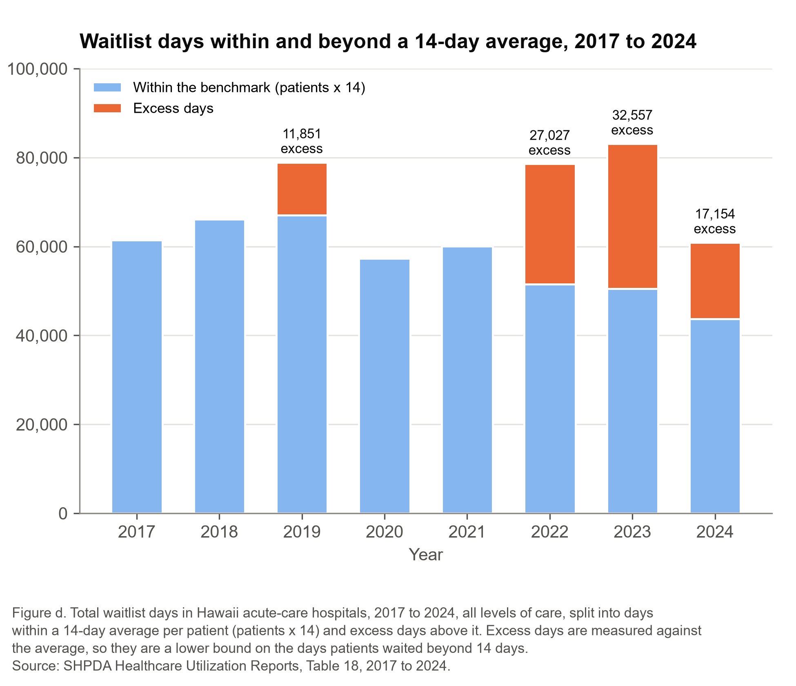

# Stuck in the Hospital: Why Hawaiʻi’s Nursing-Home Waitlist Looks Like a Bed Problem, Not a Price Problem

Micah Kosasa

BUS 620: Micro/Macro-Economic Foundations for Managers

Individual Research Paper

September 29, 2026

---

# Stuck in the Hospital: Why Hawaiʻi’s Nursing-Home Waitlist Looks Like a Bed Problem, Not a Price Problem

## The Challenge

Every year, thousands of Hawaiʻi patients finish hospital treatment but cannot leave, because no nursing facility[^1] or other care setting can take them yet. In 2024, 3,123 of these “waitlisted” patients spent 60,876 days in acute-care beds, an average of 19.5 days each (SHPDA, 2018–2025). Borrowing from Scotland’s two-week target (NHS Borders, 2015), I use a 14-day average as a benchmark. Hawaiʻi met it in 2017, 2018, 2020 and 2021 but not since, peaking at 23.0 days in 2023 (Figure a).

The wait harms patients, who weaken and risk infections and falls, and it costs hospitals. Measured against the 14-day average, 2024 had at least 17,154 excess days,[^2] the equivalent of about 47 beds on an average day (Figure d). Medicaid pays a hospital $486.76 for a waitlisted day (Med-QUEST, 2015–2025), but the hospital’s avoidable cost is roughly $550 to $1,470.[^3] At today’s rate the excess days cost hospitals about $1.1 million to $16.9 million a year. The question for the Healthcare Association of Hawaii, which represents the state’s hospitals, is which option, if any, to pursue: (1) wait for Medicaid’s 2024 rate reset to work, (2) lobby for a Medicaid add-on payment for hard-to-place patients, (3) have hospitals pay homes a per-day top-up, or (4) build new transitional capacity[^4] through a partnership.

## The Economics and the Tests

Medicaid pays nursing homes an administered price: the state sets the daily rate and homes are price takers.[^5] For years the median rate sat 19 to 29% below the median cost of homes that serve mostly Medicaid patients (Figure c). The natural suspect is opportunity cost. A Medicaid resident stays a long time (about 543 days at the median Hawaiʻi home; CMS, n.d.), while the same bed could serve a run of short, better-paid Medicare stays. Count that forgone margin as a cost, as economic profit[^6] does, and a home can lose by admitting a Medicaid patient even when the rate covers the cost of care. If so, homes’ willingness to admit Medicaid patients should be elastic[^7] to the Medicaid rate: raise it relative to other payers, and fewer patients should wait for “financial” reasons.

Hawaiʻi has run two natural experiments: the median Medicaid rate rose about 18% by July 2021, after a 12% adjustment for private homes took effect in January 2021, and 30% at the January 2024 reset, while Medicare’s nursing-home payment rose only 1.2% and 4.2% over the same windows (Centers for Medicare & Medicaid Services [CMS], 2021, 2024). Before pulling the 2017 to 2022 data, I set three tests: the hypothesis fails if the financial share of the December 31 waitlist does not fall at least 5 points after both increases; waiting wins if days per patient were already trending toward 14 before 2024; and new capacity wins if “no bed available” is the largest reason in most years. I fixed each test’s fine print after seeing the results.

## What the Data Show

The opportunity-cost test fails. The financial share did not fall; it rose 1.9 points from 2020 to 2021 and 11.1 points from 2023 to 2024, reaching 35% (Figure b). On December 31, patients waiting for financial reasons rose from 45 to 60 in 2024 while all other reasons fell by 33. COVID clouds the 2021 comparison, but not 2024’s. Homes’ willingness to admit Medicaid patients looks inelastic to the rate. Waiting fails too: before 2024, days per patient trended up about 1.9 days a year (Figure a). Capacity passes, but narrowly: “no bed available” led in five of eight years, 2017 through 2021, and has not led since 2022.

What fits all three results is a supply limit, not a price problem. Staffed beds are slow to add: on December 31, 2024, 548 licensed long-term-care beds were not staffed or set up, 353 of them for lack of staff (SHPDA, 2018–2025). When short-run supply is close to vertical,[^8] a higher price mainly raises what each existing bed earns. The reset may have helped at the margin, since “no bed” waits fell from 42 to 31 on December 31, but it did not shrink the financial group.

Two conditions shape what comes next. Since 2024 the rate rises only with a national index (Med-QUEST, 2024): from $481.83 at the reset to $495.26 in January 2026, about 1.4% a year. If costs grow at Medicare’s market-basket pace of 3.0 to 3.3% a year, the rate falls about 2.1% below Medicaid-heavy homes’ cost by fiscal 2026 and 4.0% by 2027 (CMS, 2023, 2024, 2025, 2026), and the reset’s relief fades. And if “no bed” becomes the largest reason again, the case for capacity grows.

## Recommendation

The Association should pursue new transitional capacity through a hospital–nursing home partnership rather than a Medicaid add-on or a hospital-paid top-up, and it should not simply wait. Unlike the 2024 reset, which raised pay on every Medicaid day in every home with no conditions, a partnership pays for specific staffed, short-stay beds that must take waitlisted patients: it buys quantity, not price. Start on the neighbor islands: in 2024 Honolulu County averaged 13.8 days, just under the benchmark, while Hawaiʻi, Maui and Kauaʻi counties averaged 28 to 32 days and together ran about 17,500 days over it (my calculation). The 2024 gap, about 47 beds on an average day, sets the option’s scale. Hospitals should help pay because they capture the savings: $63 to $983 per excess day avoided. How to split the bill is a normative question; the data answer only the positive one: paying homes more per day did not shrink the financial group. The Association should also ask the state to split the “financial” reason into home refusals and pending eligibility in its annual hospital survey, a cheap step that would make a future add-on testable.

## The Strongest Objection

The financial category may not carry the main test. The state does not define it, and it mixes homes turning away Medicaid patients with patients still waiting on an eligibility decision or coverage problem.[^9] A rate increase should shrink only the first group, so growing eligibility delays could have hidden a fall in refusals. Public data cannot rule this out, but it leaves the add-on unproven, and public money should follow evidence. The capacity recommendation does not rest on the financial group; it rests on the no-bed record, and the rising trend rules out waiting. Other limits: the yearly counts cover all levels of care (nursing-facility patients were 69% of the December 31, 2024 waitlist); reasons come from a one-day, self-reported snapshot; no public source splits the waitlist by payer; and staff shortages could slow new beds.

[^1]: A nursing facility (skilled nursing facility, SNF) is a nursing home giving 24-hour care to people who no longer need a hospital but cannot safely go home. Medicare (people 65 and older) pays for short rehabilitation stays; Medicaid (people with low incomes) pays for most long stays.

[^2]: Excess days are total waitlist days minus patients × 14. Because this uses the average, some patients wait more than 14 days even in a year that meets it, so the figure is a lower bound.

[^3]: Avoidable cost is what a hospital actually stops spending when a patient leaves a day sooner. I set it at 15 to 40% of the $3,664 average expense per adjusted inpatient day at Hawaiʻi nonprofit hospitals in 2023 (KFF, n.d.), since that average includes overhead that stays when one patient leaves.

[^4]: A transitional bed is a short-stay nursing bed, used for weeks rather than years, that takes patients leaving the hospital while a longer-term placement is arranged.

[^5]: An administered price is set by an authority, not by supply and demand. A price taker cannot change the price it gets; it chooses only how much to supply.

[^6]: Economic profit subtracts all costs, including the opportunity cost of the best alternative use of a resource, from revenue. Accounting profit ignores that alternative.

[^7]: Elasticity measures how strongly quantity responds to price: elastic if quantity changes by a larger percentage than price, inelastic if by less.

[^8]: If quantity cannot change in the short run, the supply curve is vertical: a higher price changes what sellers earn, not how much they supply.

[^9]: Medicaid must approve a patient’s financial eligibility before it pays a nursing home, and applications can take weeks.

## References

Centers for Medicare & Medicaid Services. (n.d.). *Skilled nursing facility cost report* [Data set, FY2011 to FY2023 files]. Retrieved September 29, 2026, from https://data.cms.gov/provider-compliance/cost-reports/skilled-nursing-facility-cost-report

Centers for Medicare & Medicaid Services. (2021, July 29). *Fiscal year (FY) 2022 skilled nursing facility (SNF) prospective payment system (PPS) final rule (CMS-1746-F)* [Fact sheet]. https://www.cms.gov/newsroom/fact-sheets/fiscal-year-fy-2022-skilled-nursing-facility-snf-prospective-payment-system-pps-final-rule-cms-1746

Centers for Medicare & Medicaid Services. (2023, July 31). *Fiscal year (FY) 2024 skilled nursing facility prospective payment system final rule - CMS-1779-F* [Fact sheet]. https://www.cms.gov/newsroom/fact-sheets/fiscal-year-fy-2024-skilled-nursing-facility-perspective-payment-system-final-rule-cms-1779-f

Centers for Medicare & Medicaid Services. (2024, July 31). *Fiscal year 2025 skilled nursing facility prospective payment system final rule (CMS 1802-F)* [Fact sheet]. https://www.cms.gov/newsroom/fact-sheets/fiscal-year-2025-skilled-nursing-facility-prospective-payment-system-final-rule-cms-1802-f

Centers for Medicare & Medicaid Services. (2025, July 31). *FY 2026 skilled nursing facility (SNF) prospective payment system final rule (CMS-1827-F)* [Fact sheet]. https://www.cms.gov/newsroom/fact-sheets/fy-2026-skilled-nursing-facility-snf-prospective-payment-system-final-rule-cms-1827-f

Centers for Medicare & Medicaid Services. (2026, July 29). *Fiscal year 2027 skilled nursing facility prospective payment system final rule (CMS 1843-F)* [Fact sheet]. https://www.cms.gov/newsroom/fact-sheets/fiscal-year-2027-skilled-nursing-facility-prospective-payment-system-final-rule-cms-1843-f

KFF. (n.d.). *Hospital expenses per adjusted inpatient day by ownership type* [Data from the AHA Annual Survey]. Retrieved September 29, 2026, from https://www.kff.org/health-costs/state-indicator/expenses-per-inpatient-day-by-ownership/

Med-QUEST Division, Hawaiʻi Department of Human Services. (2015–2025). *Medicaid fee-for-service rates* [Memoranda QI-1521 to QI-2532, rates effective January 2016 to January 2026]. https://medquest.hawaii.gov/content/medquest/en/plans-providers/provider-memo.html

Med-QUEST Division, Hawaiʻi Department of Human Services. (2024). *Hawaii state plan amendment HI-23-0014, Attachment 4.19-D: Methods and standards for establishing payment rates for long-term care facilities* [Approved by the Centers for Medicare & Medicaid Services, February 27, 2024]. https://www.medicaid.gov/sites/default/files/2024-02/HI-23-0014.pdf

NHS Borders. (2015). *Delayed discharges* [Borders NHS Board paper, Appendix-2015-13]. https://www.nhsborders.scot.nhs.uk/media/275132/delayed-discharges.pdf

State Health Planning and Development Agency (SHPDA), Hawaiʻi. (2018–2025). *Hawaii health care utilization reports, 2017 to 2024: Table 16, Licensed long-term care beds not staffed or set up as of December 31, and Table 18, Wait listed patients in acute care beds ready to discharge but unable to place*. https://health.hawaii.gov/shpda/

