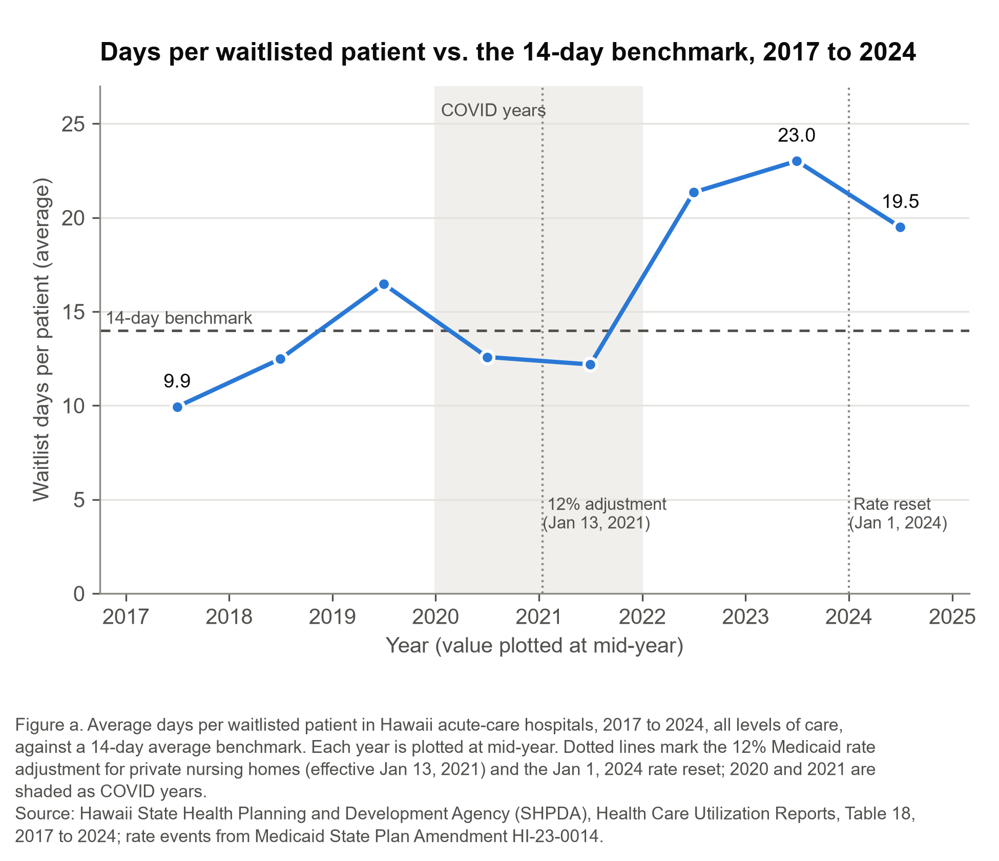
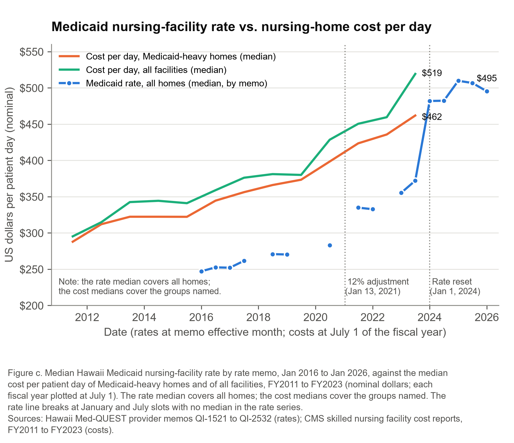
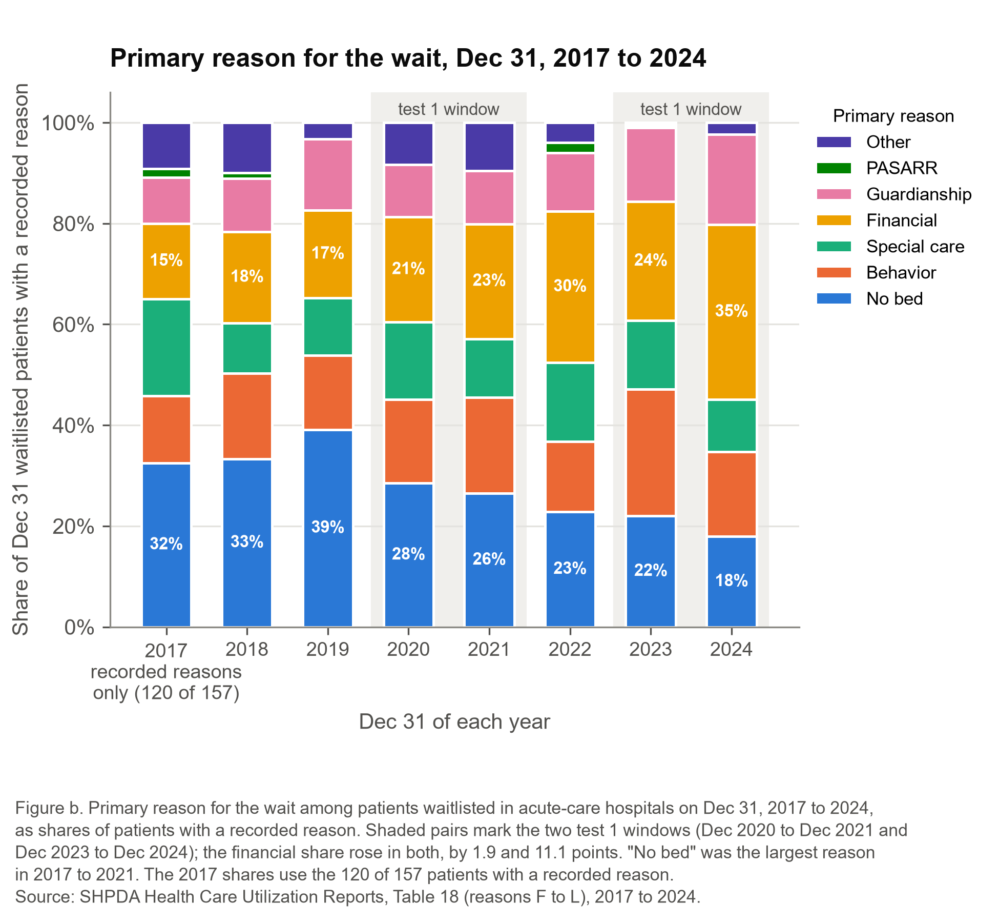

# Stuck in the Hospital: A Market Test for Hawaiʻi’s Nursing-Home Waitlist

Micah Kosasa

BUS 620: Micro/Macro-Economic Foundations for Managers

Individual Research Paper

September 30, 2026

---

# Stuck in the Hospital: A Market Test for Hawaiʻi’s Nursing-Home Waitlist

## The Challenge

Thousands of Hawaiʻi patients a year finish hospital treatment but cannot leave, because no nursing home (24-hour care for people who cannot safely go home) or other setting can take them. In 2024, 3,123 of these “waitlisted” patients spent 60,876 days in hospital beds, averaging 19.5 days each (State Health Planning and Development Agency [SHPDA], 2025b). My benchmark is a 14-day average, looser than Scotland’s two-week maximum per patient (NHS Borders, 2015). Hawaiʻi last met it in 2021; the average peaked at 23.0 days in 2023 (SHPDA, n.d.; Figure 1). It matters now because the relief after Medicaid’s 2024 rate reset may not last.

Waiting in hospital is “a poor outcome for the individual” (NHS Borders, 2015, p. 1), and it costs hospitals. Against the benchmark, 2024 had at least 17,154 excess days, about 47 beds on an average day. Medicaid, the insurer for people with low incomes, pays a hospital $486.76 for a waitlisted day (Med-QUEST, 2025). I assume the hospital’s avoidable cost, what it saves when a patient leaves a day sooner, is 15 to 40% of the $3,664 average expense per inpatient day at Hawaiʻi nonprofit hospitals (KFF, n.d.), or $550 to $1,470. Each excess day loses the hospital $63 to $983, or $1.1 million to $16.9 million a year (Appendix A). This is an externality: a home that declines a patient leaves the hospital a cost the home does not bear (Appendix B defines the terms used). The Healthcare Association of Hawaii has four options (Appendix C): wait for the 2024 rate reset; lobby for a Medicaid add-on for hard-to-place patients; have hospitals pay homes a top-up; or build transitional capacity (short-stay nursing beds) through a partnership.

## The Economics and Three Tests

Medicaid pays nursing homes an administered price: the state sets the daily rate, and homes are price takers. It long worked like a price ceiling: the median rate sat 19 to 29% below the median cost of Medicaid-heavy homes (Figure 2), too low to supply all the Medicaid beds demanded. My hypothesis was opportunity cost. A Medicaid resident stays about 543 days at the median home (Centers for Medicare & Medicaid Services [CMS], n.d.), while the same bed could serve short, better-paid stays under Medicare, the insurer for people 65 and older. Counting that forgone margin as a cost, as economic profit does, a home can lose on a Medicaid patient even when the rate covers care costs. If so, admissions should be elastic to the Medicaid rate: raising it relative to other payers should shrink the group waiting for “financial” reasons.

Hawaiʻi raised it twice. The median rate rose about 18% in 2021 and 30% at the January 2024 reset (Med-QUEST, n.d., 2024), while Medicare’s nursing-home payment rose 1.2% and 4.2% (CMS, 2021, 2024). Both increases were unconditional: they paid more for every Medicaid day, whether or not the home admitted a hospital patient. I set three tests on September 28, after seeing the 2023 and 2024 data but before pulling 2017 to 2022, and fixed their fine print afterward (Appendix D). Test 1: the hypothesis fails unless the financial share of the December 31 waitlist falls at least 5 points after an increase. Test 2: waiting wins if days per patient were trending toward 14. Test 3: capacity wins if “no bed” is the largest reason in most years.

Test 1 was falsified. The financial share rose 1.9 points from 2020 to 2021 and 11.1 points from 2023 to 2024, to 35% (Figure 3). A rise is not a weak, inelastic response; something else moved. The category is undefined, mixing refusals with pending eligibility decisions; the count is one day’s, under 200 patients; and COVID clouds 2021. Two unconditional increases did not shrink the group, reason not to bet public money on an add-on.

Test 3 was met: “no bed” led in five of eight years, so by my rule capacity wins. My recommendation departs from that verdict, a judgment I made after seeing the result. All five years are 2017 to 2021, when the benchmark was met in four. “No bed” has not led since, and its share fell from 39% in 2019 to 18% in 2024 while the financial share climbed from 17% to 35% (Figure 3). The pass therefore does not show a bed shortage today; neither price nor beds is proven to be the binding limit.

Test 2 was not met: days per patient had risen nearly two days a year (Figure 1). It stops at 2023, and 2024 is waiting’s best evidence: waitlist days fell 27%. But the reset has no scheduled rebase, only an index update (Med-QUEST, 2024), and the median rate went from $481.83 in January 2024 to $509.69 a year later, then $495.26 in January 2026, an unexplained drop (Med-QUEST, n.d., 2025), a net 1.4% a year. If costs grow at Medicare’s market-basket pace, 3.0 to 3.3% (CMS, 2023, 2024, 2025, 2026), the rate falls 2.1% below Medicaid-heavy homes’ cost in fiscal 2026 and 4.0% in 2027, reopening the gap.

## Recommendation

The data cannot say whether the limit is willingness or beds, so the Association should make homes reveal it. Its member hospitals should offer a payment per placed patient atop Medicaid’s rate to any home that guarantees admission. A guarantee means the hospital picks the patient, and the home must admit, within 14 days, anyone its license allows it to care for; otherwise it could commit beds and take only easier cases. The cap is what a hospital saves: $347 to $5,401 per placed patient, each hospital setting its own. That is $63 to $983 a day for the 5.5 days saved when a 19.5-day average wait is cut to 14. The low end rests on my 15% assumption. If within six months homes commit existing staffed beds equal to the 2024 gap, about 47, the top-up works and should continue. I chose these terms after the results; six months is a judgment, matching the twice-yearly rate cycle, and 47 beds assumes full occupancy and covers all levels of care.

If homes refuse a low offer, that shows little: $347 is short of the roughly $5,900 by which projected cost exceeds the rate over a 543-day stay (Appendix A). A refusal near the cap shows only that a capped payment is not enough. It does not show new beds will work: homes may lack staff, or the patients may be behavior and guardianship cases, about a third of the December 31, 2024 waitlist (Figure 3). The Association should record why homes decline.

I expect homes to refuse, because 353 long-term-care beds sit idle for lack of staff (SHPDA, 2025a). That is an expectation, not a finding. If they do, the Association should end the offer and let the recorded reasons decide. If homes cite staff or space, it should convene hospitals and the state to plan transitional beds, costing staff first, since new beds need the same scarce workers. If homes cite the patients, new beds will not help, a problem outside this paper. Who should pay, hospitals or Medicaid, is a normative question; the test answers the positive one.

The strongest objection is that I have shown price does not work, yet propose paying homes more. But neither increase depended on whether a resident came off the waitlist. Most of the money went to residents already in beds, and none of it paid a home more for taking a waitlisted patient than for any other Medicaid admission with the same care needs. The offer pays only for that admission, and the guarantee keeps homes from picking easier cases.

The Association should neither wait nor lobby for an unproven add-on, but offer a capped, conditional payment for six months, keep it if about 47 beds are committed, and if not, learn why before planning beds. The limits are one-day, self-reported counts, an undefined financial category, an unknown payer mix, and my avoidable-cost assumption.

## References

Centers for Medicare & Medicaid Services. (n.d.). *Skilled nursing facility cost report* [Data set, FY2011 to FY2023 files]. Retrieved September 29, 2026, from https://data.cms.gov/provider-compliance/cost-reports/skilled-nursing-facility-cost-report

Centers for Medicare & Medicaid Services. (2021, July 29). *Fiscal year (FY) 2022 skilled nursing facility (SNF) prospective payment system (PPS) final rule (CMS-1746-F)* [Fact sheet]. https://www.cms.gov/newsroom/fact-sheets/fiscal-year-fy-2022-skilled-nursing-facility-snf-prospective-payment-system-pps-final-rule-cms-1746

Centers for Medicare & Medicaid Services. (2023, July 31). *Fiscal year (FY) 2024 skilled nursing facility prospective payment system final rule - CMS-1779-F* [Fact sheet]. https://www.cms.gov/newsroom/fact-sheets/fiscal-year-fy-2024-skilled-nursing-facility-perspective-payment-system-final-rule-cms-1779-f

Centers for Medicare & Medicaid Services. (2024, July 31). *Fiscal year 2025 skilled nursing facility prospective payment system final rule (CMS 1802-F)* [Fact sheet]. https://www.cms.gov/newsroom/fact-sheets/fiscal-year-2025-skilled-nursing-facility-prospective-payment-system-final-rule-cms-1802-f

Centers for Medicare & Medicaid Services. (2025, July 31). *FY 2026 skilled nursing facility (SNF) prospective payment system final rule (CMS-1827-F)* [Fact sheet]. https://www.cms.gov/newsroom/fact-sheets/fy-2026-skilled-nursing-facility-snf-prospective-payment-system-final-rule-cms-1827-f

Centers for Medicare & Medicaid Services. (2026, July 29). *Fiscal year 2027 skilled nursing facility prospective payment system final rule (CMS 1843-F)* [Fact sheet]. https://www.cms.gov/newsroom/fact-sheets/fiscal-year-2027-skilled-nursing-facility-prospective-payment-system-final-rule-cms-1843-f

KFF. (n.d.). *Hospital expenses per adjusted inpatient day by ownership type* [Data from the AHA Annual Survey]. Retrieved September 29, 2026, from https://www.kff.org/health-costs/state-indicator/expenses-per-inpatient-day-by-ownership/

Med-QUEST Division, Hawaiʻi Department of Human Services. (n.d.). *Provider memos* [Medicaid fee-for-service rate memoranda QI-1521 to QI-2515, rates effective January 2016 to July 2025]. Retrieved September 29, 2026, from https://medquest.hawaii.gov/content/medquest/en/plans-providers/provider-memo.html

Med-QUEST Division, Hawaiʻi Department of Human Services. (2024). *Hawaii state plan amendment HI-23-0014, Attachment 4.19-D: Methods and standards for establishing payment rates for long-term care facilities* [Approved by the Centers for Medicare & Medicaid Services, February 27, 2024]. https://www.medicaid.gov/sites/default/files/2024-02/HI-23-0014.pdf

Med-QUEST Division, Hawaiʻi Department of Human Services. (2025, December 23). *Medicaid fee-for-service rates for all nursing and hospice facilities effective January 1, 2026* (Memo No. QI-2532). https://medquest.hawaii.gov/content/dam/formsanddocuments/provider-memos/qi-memos/qi-memos-2025/QI_2532.pdf

NHS Borders. (2015). *Delayed discharges* [Borders NHS Board paper, Appendix-2015-13]. https://www.nhsborders.scot.nhs.uk/media/275132/delayed-discharges.pdf

State Health Planning and Development Agency. (n.d.). *Healthcare utilization reports and survey instructions* [Annual Tables 16 and 18, 2017 to 2023 data]. Retrieved September 29, 2026, from https://health.hawaii.gov/shpda/agency-resources-and-publications/health-care-utilization-reports-and-survey-instructions/

State Health Planning and Development Agency. (2025a). *Table 16. Licensed long-term care beds not staffed or set up as of December 31, 2024*. https://health.hawaii.gov/shpda/files/2025/09/2024UR-Table-16-Licensed-Long-Term-Care-Beds-Not-Staffed-or-Set-Up.pdf

State Health Planning and Development Agency. (2025b). *Table 18. Wait listed patients in acute care beds ready to discharge but unable to place, 2024*. https://health.hawaii.gov/shpda/files/2025/09/2024UR-Table-18-Wait-Listed-Patients-in-Acute-Care-Beds.pdf

## Appendix A: Calculations

All inputs are from the sources cited in the text. Dollar figures per day are shown to the cent; totals are rounded in the text. The $3,664 figure is the 2023 average expense per adjusted inpatient day at Hawaiʻi nonprofit hospitals (KFF, n.d.).

| Step | Calculation | Result |
|---|---|---|
| Excess days, 2024 | 60,876 waitlist days − (3,123 patients × 14 days) | 17,154 days. Measured against the average, so a lower bound on days waited beyond 14. |
| Beds on an average day | 17,154 ÷ 366 days | 46.9 beds. Assumes full occupancy; covers all levels of care (nursing-home patients were 69% of the December 31, 2024 count). |
| Avoidable cost per day (assumption) | 15% and 40% of $3,664 | $550 to $1,470, rounded. The 15 to 40% share is my assumption. |
| Hospital’s net loss per excess day | $550 − $486.76; $1,470 − $486.76 | $63.24 to $983.24 |
| Yearly cost of excess days | 17,154 × $63.24; 17,154 × $983.24 | $1,084,819 to $16,866,499 |
| Offer cap per placed patient | $63.24 × (60,876 ÷ 3,123 − 14 days); $983.24 × (60,876 ÷ 3,123 − 14 days) | $347.36 to $5,400.74, for the 5.49 days saved. The 14-day window is my judgment. Chosen after the results; not a test. |
| Rate pace since the reset | ($495.26 ÷ $481.83)^(1/2) − 1 | 1.4% a year |
| Cost carried forward | $461.79 (fiscal 2023 median, Medicaid-heavy homes) × 1.03 × 1.03 × 1.033; then × 1.033 | $506.08 (fiscal 2026); $522.78 (fiscal 2027). A national index stands in for Hawaiʻi cost growth; not a forecast. |
| Rate below cost | 1 − $495.26 ÷ $506.08; 1 − $502.11 ÷ $522.78 | 2.1% (fiscal 2026); 4.0% (fiscal 2027) |
| Why a refusal at a low offer shows little | ($506.08 − $495.26) × 543 days: projected cost above the rate over a median Medicaid stay | About $5,900, more than the $347.36 low-end cap. Rough: my own comparison, mixing the cost of Medicaid-heavy homes with the rate for all homes, and nursing-home days with hospital days. |
| Unstaffed beds against the gap | 548 licensed long-term-care beds not staffed or set up on December 31, 2024, 353 of them for lack of staff: 548 ÷ 46.9; 353 ÷ 46.9 | 11.7 and 7.5 times. A comparison of scale, not a bed-for-bed match. |
| Behavior and guardianship share of the waitlist | (29 + 31) ÷ 173 patients on December 31, 2024 | 35%, about a third |

## Appendix B: Terms

Health care and economics terms used in the paper.

| Term | Meaning |
|---|---|
| Nursing home | A nursing facility or skilled nursing facility (SNF): 24-hour care for people who no longer need a hospital but cannot safely go home. |
| Waitlisted patient | A hospital patient who no longer needs acute care but cannot be discharged because no appropriate setting can take them. |
| Medicaid and Medicare | Medicaid is the joint state and federal insurer for people with low incomes; it pays for most long nursing-home stays. Medicare is the federal insurer for people 65 and older; it pays for short rehabilitation stays. |
| Avoidable cost | What a hospital stops spending when a patient leaves a day sooner. It is less than average cost, because much of the average is overhead that stays. |
| Externality | A cost or benefit of a decision that falls on someone other than the one deciding. |
| Transitional bed | A short-stay nursing bed, used for weeks rather than years, for patients leaving the hospital while a longer-term placement is arranged. |
| Administered price | A price set by an authority rather than by supply and demand. |
| Price taker | A seller that cannot change the price it receives. |
| Price ceiling | A legal maximum price. It is binding, and causes a shortage, when set below the equilibrium price. The Medicaid rate acts like one for Medicaid patients. |
| Opportunity cost | What a resource would earn in its best alternative use. |
| Economic profit | Revenue minus all costs, including opportunity cost. Accounting profit leaves opportunity cost out. |
| Elasticity | How strongly quantity responds to price. Elastic means a large response; inelastic means a small one. |
| Positive and normative | A positive statement describes what is and can be tested; a normative statement says what should be. |

## Appendix C: The Four Options Compared

The four options side by side. Only the top-up has a cost per excess day avoided that this paper can bound; the others are not costed here.

| Option | Who pays | What the evidence says | Place in the recommendation |
|---|---|---|---|
| Wait for the 2024 reset | No one | Waitlist days fell 27% in 2024, but the average stayed above 14 and the rate is projected to fall 2.1 to 4.0% below cost again | Rejected |
| Medicaid add-on | Medicaid (state and federal) | Two unconditional rate increases did not shrink the financial group | Rejected for now; unproven |
| Hospital-paid top-up | Hospitals, at most $347 to $5,401 per placed patient | Untested: no conditional payment has been tried | Tested first; kept if homes commit about 47 beds in six months |
| New transitional capacity | Hospitals and partners; not costed | “No bed” led only in 2017 to 2021; 353 beds are idle for lack of staff | Planned if the offer fails, after recording why homes declined; the outcome I expect |

## Appendix D: The Three Tests as Set

I set the three tests on September 28, 2026, after I had seen the 2023 and 2024 data and before I pulled the 2017 to 2022 data. I fixed the definitions in the third column the same day, after seeing the results. 2020 and 2021 are COVID years.

| Test | Rule as set | Definition fixed after the results | Result | Verdict |
|---|---|---|---|---|
| 1. Opportunity cost | Falsified if the financial share of the December 31 waitlist does not fall at least 5 points after both rate increases (read leniently: only if it falls short both times) | Shares are of patients with a recorded reason, compared unrounded | Rose 1.9 points (2020 to 2021) and 11.1 points (2023 to 2024) | Falsified |
| 2. Wait for the reset | Wins if days per patient were already falling steadily toward 14 before 2024 | A downward linear trend, 2017 to 2023 | Trend of +1.9 days per patient a year | Not met |
| 3. New capacity | Wins if “no bed available” is the largest reason in most years, 2017 to 2024 | More than half the years (5 of 8); a tie counts as not largest; 2017 uses the 120 of 157 patients with a recorded reason | Largest in 5 years, 2017 to 2021; not since | Met |
